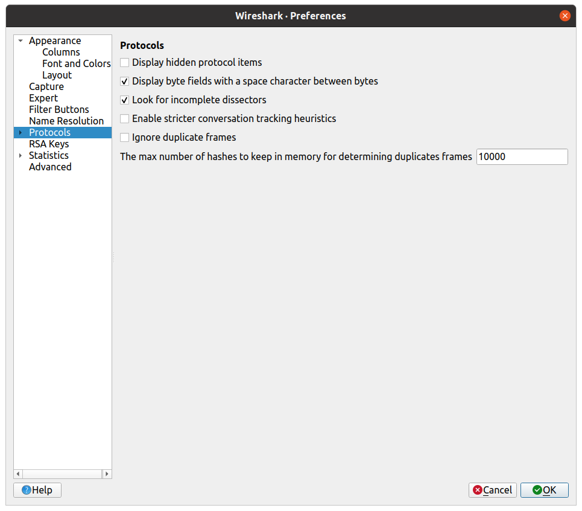
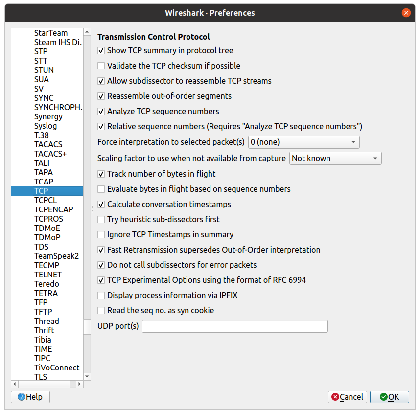

# lineage2wireshark

Login server: now static only dissector.

## Support Protocols
* Login server: 785a
* Game server: 660, 709

## Wireshark Filters
* Login server: lineage2login (tcp.srcport == 2106 || tcp.dstport == 2106)
* Game server: lineage2game (tcp.srcport == 7777 || tcp.dstport == 7777)
* Show only packets: && tcp.len != 0

## Wireshark Preferences
### Protocols

### Protocols -> TCP
* Validate the TCP checksum if possible (?)
* Allow subdissector to reassemble TCP streams
* Reassemble out-of-order segments
* Analyze TCP sequence numbers
* Do not call subdissectors for error packets (?)


## Wireshark cautions
* After `Reload Lua Plugins` need to `Reload this file` (otherwise invalid sequence)
* Switch between LINEAGE packet and TCP error packet break sequence crypt
(to restore switch to LINEAGE packet)

## Find client static BlowFish private key
```
system/engine.dll -> Ghidra -> Search call InitializeBlowfish -> Arg 2 -> key
```
* Try all found keys and find one valid.

## Utility
Convert binary to image
```sh
convert -depth 8 -size 16x16+0 gray:in.bin out.png
```

## Dependency
* Wireshark 4.2.2 (other not tested)
* Lua 5.2
* luarocks
* luacrypto2

## Thirdparty
* lua-ini (modified)

```shell
sudo luarocks install luacrypto2
```

INFO: http://mkottman.github.io/luacrypto/manual.html#reference